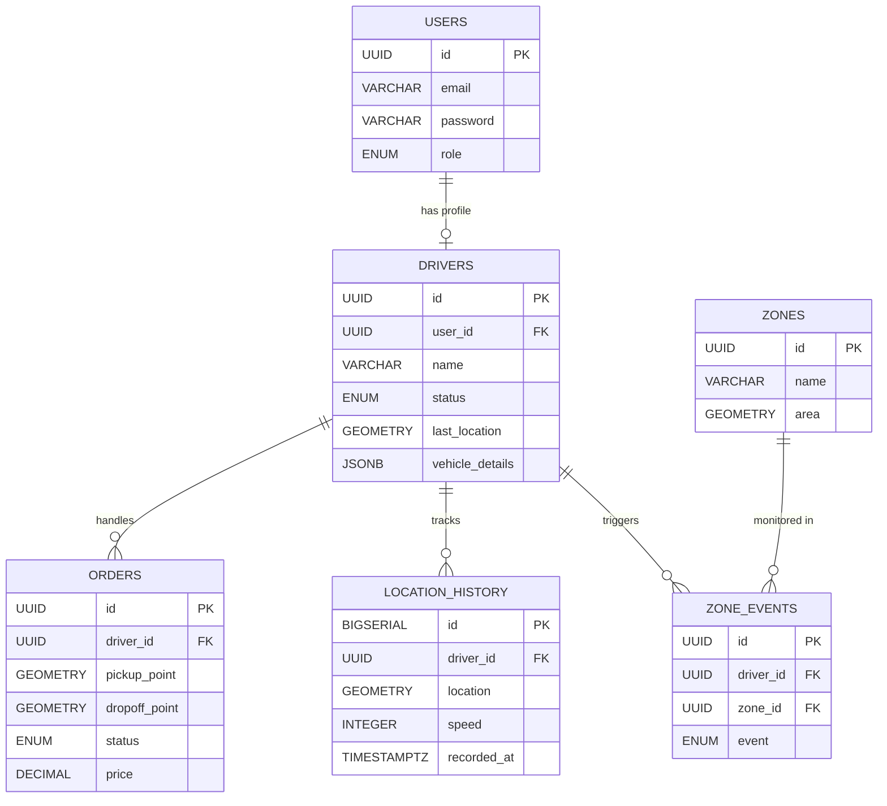

### ERD Schema Overview

#### 1. Core & Auth (Manajemen User)

Tabel ini menangani autentikasi. Kita pisahkan data login (`users`) dengan data profil pengemudi (`drivers`) agar lebih bersih.

**Table: `users`**
*Menyimpan kredensial login (Admin & Driver).*

| Atribut | Tipe Data (PostgreSQL) | Keterangan |
| :--- | :--- | :--- |
| `id` | `UUID` (PK) | Primary Key. |
| `email` | `VARCHAR(255)` | Unique. |
| `password` | `VARCHAR` | Hashed password. |
| `role` | `ENUM('admin', 'driver')` | Untuk otorisasi RBAC. |
| `created_at` | `TIMESTAMPTZ` | Waktu dibuat. |

---

#### 2. Fleet Operations (Manajemen Armada & Driver)

Ini adalah inti dari manajemen armada. Perhatikan kolom `last_location` yang menggunakan tipe data spasial.

**Table: `drivers`**
*Detail spesifik pengemudi. Relasi 1-to-1 dengan users.*

| Atribut | Tipe Data (PostgreSQL) | Keterangan |
| :--- | :--- | :--- |
| `id` | `UUID` (PK) | Primary Key. |
| `user_id` | `UUID` (FK) | Relasi ke `users.id`. |
| `name` | `VARCHAR(100)` | Nama lengkap driver. |
| `phone` | `VARCHAR(20)` | Nomor HP. |
| `status` | `ENUM('idle', 'busy', 'offline')` | Status ketersediaan. |
| `last_location` | `GEOMETRY(POINT, 4326)` | **PENTING:** Koordinat terakhir driver untuk query "terdekat". |
| `vehicle_details` | `JSONB` | Info kendaraan (Plat nomor, jenis, warna) agar fleksibel. |
| `updated_at` | `TIMESTAMPTZ` | Kapan lokasi terakhir diupdate. |

**Table: `orders`**
*Pesanan pengiriman barang.*

| Atribut | Tipe Data (PostgreSQL) | Keterangan |
| :--- | :--- | :--- |
| `id` | `UUID` (PK) | Primary Key. |
| `customer_name` | `VARCHAR(100)` | Nama pemesan. |
| `pickup_point` | `GEOMETRY(POINT, 4326)` | Koordinat penjemputan. |
| `dropoff_point` | `GEOMETRY(POINT, 4326)` | Koordinat tujuan. |
| `pickup_address` | `TEXT` | Alamat lengkap (string) penjemputan. |
| `dropoff_address` | `TEXT` | Alamat lengkap (string) tujuan. |
| `status` | `ENUM('pending', 'assigned', 'picked_up', 'delivered', 'cancelled')` | Status order. |
| `driver_id` | `UUID` (FK) | Relasi ke `drivers.id` (Nullable, jika belum dapat driver). |
| `price` | `DECIMAL(10, 2)` | Harga pengiriman. |
| `created_at` | `TIMESTAMPTZ` | Waktu order masuk. |

---

#### 3. Geospatial & History (Fitur Unggulan)

Bagian ini yang membuat proyekmu "mahal" dan menarik secara teknis.

**Table: `zones`**
*Area polygon untuk fitur Geofencing (misal: area gudang, area macet, zona merah).*

| Atribut | Tipe Data (PostgreSQL) | Keterangan |
| :--- | :--- | :--- |
| `id` | `UUID` (PK) | Primary Key. |
| `name` | `VARCHAR(100)` | Nama zona (mis: "Gudang Pusat"). |
| `area` | `GEOMETRY(POLYGON, 4326)` | **PENTING:** Menyimpan bentuk area (segitiga, kotak, dll). |
| `description` | `TEXT` | Deskripsi zona. |

**Table: `location_history`**
*Menyimpan jejak perjalanan driver (breadcrumb). Tabel ini akan sangat besar, jadi perlu indexing yang baik.*

| Atribut | Tipe Data (PostgreSQL) | Keterangan |
| :--- | :--- | :--- |
| `id` | `BIGSERIAL` (PK) | Auto increment integer (hemat storage dibanding UUID). |
| `driver_id` | `UUID` (FK) | Relasi ke `drivers.id`. |
| `location` | `GEOMETRY(POINT, 4326)` | Posisi pada waktu tersebut. |
| `speed` | `INTEGER` | Kecepatan (km/h) saat itu (opsional). |
| `heading` | `INTEGER` | Arah hadap (0-360 derajat) untuk rotasi icon di map. |
| `recorded_at` | `TIMESTAMPTZ` | Waktu perekaman. |

**Table: `zone_events`**
*Log notifikasi saat driver masuk/keluar zona (Triggered by Logic).*

| Atribut | Tipe Data (PostgreSQL) | Keterangan |
| :--- | :--- | :--- |
| `id` | `UUID` (PK) | Primary Key. |
| `driver_id` | `UUID` (FK) | Relasi ke `drivers.id`. |
| `zone_id` | `UUID` (FK) | Relasi ke `zones.id`. |
| `event` | `ENUM('enter', 'exit')` | Masuk atau keluar zona? |
| `timestamp` | `TIMESTAMPTZ` | Waktu kejadian. |

---

### Visualisasi Relasi (Mermaid Syntax)

Kamu bisa copy kode di bawah ini ke editor markdown yang support Mermaid (seperti GitHub atau Notion) untuk melihat diagramnya.

